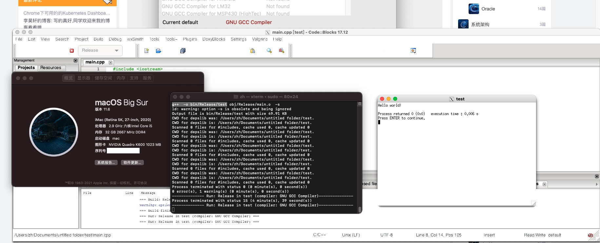

# BUILD_CODEBLOCKS_17.12_ON_MAC_BIG_SUR
为 Mac Big Sur 构建 Codeblocks 并进行编程

### Installing XCode Developer Tools
安装 Xcode 编译环境库

1.Run `sudo xcode-select — install` into the Terminal window

2.Run `sudo xcodebuild -license` into the Terminal window

在终端运行以上两条命令，安装。

### Installing XQuartz  & Installing MacPorts
安装 显示支持库和构建环境。

1. Downloading [XQuartz](https://www.xquartz.org/) and installing, you have to logout desktop and login again. 
2. 
3. Downloading [MacPorts](https://www.macports.org/install.php) and installing, you have to choose currently version

下载安装以上适合您系统的两个依赖环境，其中 XQuartz 需要重新登出登陆桌面后有效。

### Installing Code::Blocks using MacPorts

Run `sudo port install codeblocks` into the Terminal window and build codeblocks

在终端运行以上命令，构建安装。

### Running

1. Run `sudo codeblocks` into the Terminal window to run, *Use Applications will be crashed when use, instead of running it in Terminal*, ** DO NOT CLOSE TERMINAL (CTRL+C) WHEN USE CODEBLOCKS  **

2. FILE - NEW - PROJECT - Console Project *Then choose Release version*. 

3. BUILD - BUILD AND RUN 

4. Exist by close terminal or press `CTRL + C`

请通过终端运行打开 codeblocks，直接打开程序可能会崩溃。
运行 codeblocks 时请勿关闭终端。
建议构建命令行程序 Release 版本，Debug 版本可能提示缺少调试器。
通过终端关闭 codeblocks。

### Bugs

- Manger will not be show when runing everytime, Open it on VIEW - MANGER

左边项目管理器每次打开都会消失不见，请自己打开。

### Thanks

> https://medium.com/@jacob.suchorabski/install-codeblocks-17-12-on-macos-mojave-58c72079de7d

